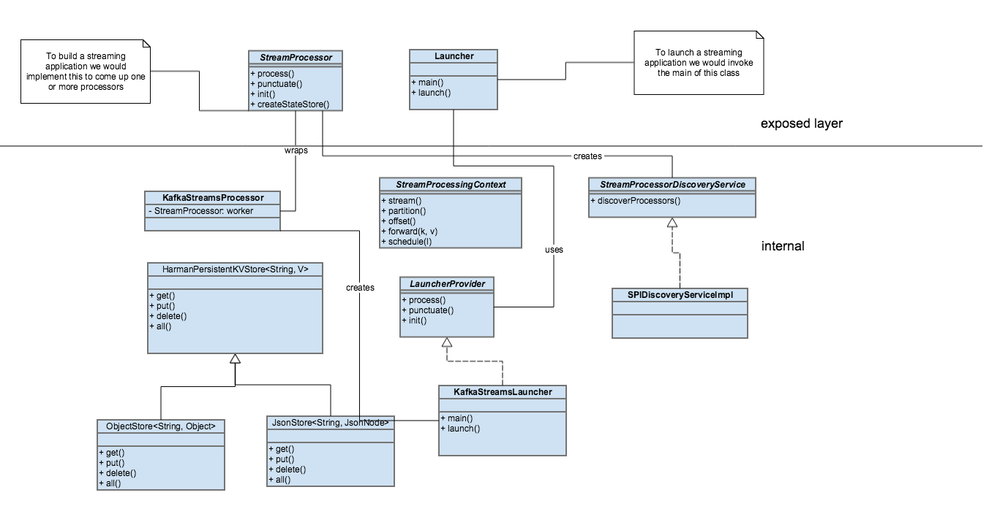

[](./images/logo.png)

# Stream-base
[](https://github.com/eclipse-ecsp/streambase/actions/workflows/maven-publish.yml)
[](https://github.com/eclipse-ecsp/streambase/actions/workflows/license-compliance.yml)

`streambase` library provides a layer of abstraction for kafka-streams to the similar stream processing systems and allows them to have some level of portability.

It provides a `LauncherProvider` interface to the services to which in turn provides the service with the capabilities to create a stream processing application.
The `Launcher` class in coordination with the `StreamProcessorDiscoveryService` creates a topology as a chain of `StreamProcessor` in the kafka streams application.



It provides the below capabilities to the streaming services:
1. Implements a discovery service `StreamProcessorDiscoveryService` to create the chain of processors (preprocessors and postprocessors along with service processors ) in the stream.
2. Implements a `KafkaTopicsHealthMonitor` to monitor the health of the topics.
3. Implements a `BackdoorKafkaConsumer` to create customized consumers along with callback capabilities.
4. Utilizes both in-memory and RocksDB state stores depending upon the configuration. Also, provides the metrics reporting capabilities for the RocksDB state store.
5. Manages the state of the topics, partitions and offsets in the database.
6. Provides TLS capabilities by integrating with vault.
7. Integrates with both Paho MQTT client and Hive MQTT client and allows for dynamic switching between the two with zero scheduled downtime and uses `MqttDispatcher` to dispatch the messages to the mqtt client.


# Table of Contents
* [Getting Started](#getting-started)
* [Usage](#usage)
* [How to contribute](#how-to-contribute)
* [Built with Dependencies](#built-with-dependencies)
* [Code of Conduct](#code-of-conduct)
* [Authors](#authors)
* [Security Contact Information](#security-contact-information)
* [Support](#support)
* [Troubleshooting](#troubleshooting)
* [License](#license)
* [Announcements](#announcements)


## Getting Started

To build the project locally after it has been forked/cloned, run:

```mvn clean install```

from the command line interface.

### Prerequisites

1. Maven
2. Java 17
3. Redis
4. MongoDB instance
5. HiveMQ instance

### Installation

[How to set up maven](https://maven.apache.org/install.html)

[Install Java](https://stackoverflow.com/questions/52511778/how-to-install-openjdk-11-on-windows)

[How to Install Redis](https://redis.io/docs/install/install-redis/)

[How to Install MongoDB](https://www.mongodb.com/docs/manual/installation/)

[How to Install HiveMQ](https://docs.hivemq.com/hivemq/latest/user-guide/install-hivemq.html)

### Running the tests

```mvn test```

Or run a specific test

```mvn test -Dtest="TheFirstUnitTest"```

To run a method from within a test

```mvn test -Dtest="TheSecondUnitTest#whenTestCase2_thenPrintTest2_1"```

### Deployment

`stream-base` project serves as a library for the services. It is not meant to be deployed as a service in any cloud environment.

## Usage
Add the following dependency in the target project
```
<dependency>
  <groupId>org.eclipse.ecsp.analytics</groupId>
  <artifactId>stream-base</artifactId>
  <version>1.X.X</version>
</dependency>
```

### Creating a Stream Processor

To create a kafka stream processor, the service need to create an object of type `StreamProcessor` and specify the Serdes. 
2 sets of Serdes are required, one for the incoming key and value types and the other for the outgoing key and value types.

Ex:

```java
/**
 * This interface needs to be implemented by all Ignite-Auto Stream Processors
 * henceforth. The signature is IgniteKey and IgniteEvent which will be common
 * across the stream processors in Ignite systems. Also, this will be key for
 * processor chaining.
 *
 */
public interface IgniteEventStreamProcessor extends StreamProcessor<IgniteKey<?>, IgniteEvent, IgniteKey<?>, IgniteEvent> {

}
```
The `IgniteEventStreamProcessor` interface needs to be implemented by all Ignite-Auto Stream Processors.

The above stream processor can be classified into these categories:
-   Preprocessor
-   Service Processor
-   Postprocessor

As highlighted above, the discovery service is responsible for creating the kafka topology with the above set of processors. 
The service processor/s will be sandwiched between the preprocessor and postprocessor by the discovery service.

```properties
discovery.impl.class.fqn=org.eclipse.ecsp.analytics.stream.base.discovery.PropBasedDiscoveryServiceImpl
launcher.impl.class.fqn=org.eclipse.ecsp.analytics.stream.base.KafkaStreamsLauncher
pre.processors=org.eclipse.ecsp.analytics.stream.base.processors.TaskContextInitializer,org.eclipse.ecsp.analytics.stream.base.processors.ProtocolTranslatorPreProcessor,org.eclipse.ecsp.digitalkey.sp.processor.VehicleStatePreProcessor,org.eclipse.ecsp.platform.dff.agent.processors.DFFAgentPreProcessor,org.eclipse.ecsp.analytics.stream.base.processors.DeviceMessagingAgentPreProcessor
service.stream.processors=org.eclipse.ecsp.digitalkey.sp.DigitalKeyMessageProcessor
post.processors=org.eclipse.ecsp.digitalkey.sp.processor.IgniteEventWithSignaturePostProcessor,org.eclipse.ecsp.analytics.stream.base.processors.SchedulerAgentPostProcessor,org.eclipse.ecsp.analytics.stream.base.processors.DeviceMessagingAgentPostProcessor,org.eclipse.ecsp.platform.dff.agent.processors.DFFAgentPostProcessor
```

Here, we have specified to use `PropBasedDiscoveryServiceImpl` as the discovery service as we want to create the topology based on the properties specified.
Also, we have used `KafkaStreamsLauncher` as the launcher class which will be utilized by the discovery service to create the topology.

The source topics and the sink topics are provided by the application with these properties:

```properties
source.topic.name=spaak,activation,dk-termination-response
sink.topic.name=https-integ-high
```

All the processors (pre, service, post) will be subscribed to the source topics and will publish to the sink topics. 
If there are no sinkers specified, the last processor in the chain will publish to the sink topics.

### Topics Health Monitoring

The topics whose health need to be monitored can be specified in the properties file as shown below:

```properties
kafka.topics.file.path=/data/topics.txt
```

The structure of the file specifies the topic name along with the number of partitions and the replication factor as shown below:

```txt
    spaak|25|2
    activation|25|2
    dk-termination-response|25|2
    digital-key-sp-dlq|25|2
    dk_service_provisioning|25|2
    device-status-digital-key-sp|25|2
    dev-stolenvehicle|25|2
    vehicle-profile-modified-authorized-users|25|2
    vehicle-profile-modified-serial-no|25|2
```

> **_NOTE:_**  The above topics must be existing in the kafka cluster.

### State stores

Following state stores are supported by the `streambase` library:
-   In-memory state store
-   RocksDB state store

To specify the type of state store to be used by the service along with other state store properties:

```properties
state.dir=/tmp/kafka-streams
state.store.changelog.enabled=false
state.store.type=map
```

> **_NOTE:_** A `StreamProcessor` must not provide the implementation of `createStateStore` method, if they want HashMap as state store instead of the RocksDB store.

#### Customizing state store and state store type

The state store can be customized while creating an instance of `StreamProcessor` by overriding the `createStateStore` method. However, the `StreamProcessor` must not provide the implementation of `createStateStore` method, if they want HashMap as state store instead of the RocksDB store.

Example:

```java
    @Override
    public HarmanPersistentKVStore createStateStore() {
        // 
    }
```

### In-memory cache

There are various in-memory caches maintained by streambase library for its internal use along with maintaining the metrics for each. Some of them are following:

- RetryRecord cache.
- RetryBucket cache.
- Connection status cache.
- Shoulder Tap RetryRecord cache.
- Shoulder Tap RetryBucket cache.

More documentation regarding the low-level design for this can be found [here](https://confluence.harman.com/confluence/display/HCP/Stream-Base+Metrics)

### Kafka configuration

To connect to kafka, the following properties need to be specified in the properties file along with the optional TLS properties:

```properties
#Comma separated list of kafka brokers
bootstrap.servers=127.0.0.1:9092
#Comma separated list of zookeepers
zookeeper.connect=127.0.0.1:2181

# TLS properties
kafka.ssl.enable=false
kafka.ssl.client.auth=required
kafka.client.keystore=keystore.jks
kafka.client.keystore.password=****************
kafka.client.key.password=****************
kafka.client.truststore=truststore.jks
kafka.client.truststore.password=****************
```

### Vault Configuration

Vault can be configured to provide the TLS security details to the service to connect to the kafka broker. The following properties need to provided:

```properties
vault.enabled=false
health.vault.monitor.enabled=false
health.vault.needs.restart.on.failure=false
```

### MongoDB configuration

To connect to the MongoDB instance, the following properties need to be specified in the properties file:

```properties
mongodb.hosts=localhost
mongodb.port=27017
mongodb.username=dummyUser
mongodb.username=dummyUser
mongodb.auth.db=admin
mongodb.name=admin
mongodb.pool.max.size=200
```

### Redis configuration

To connect to the Redis instance for caching capabilities, the following properties need to be specified in the properties file:

```properties
redis.address=127.0.0.1:6379
redis.sentinels=
redis.master.name=
redis.read.mode=SLAVE
redis.subscription.mode=SLAVE
redis.database=0
redis.password=
```

### MQTT configuration

To connect to the MQTT broker for publishing to the MQTT topics, the following properties need to be specified in the properties file:

```properties
mqtt.broker.url=tcp://127.0.0.1:1883
mqtt.topic.separator=/
mqtt.config.qos=1
mqtt.user.name=*******************
mqtt.user.password=dummyPass
mqtt.service.topic.name=test
```

### Health configuration

Health monitoring for different components can be enabled by specifying the following properties:

```properties
health.mqtt.monitor.enabled=false
health.mongo.monitor.enabled=false
health.kafka.consumer.group.monitor.enabled=false
health.device.status.backdoor.monitor.enabled=false
health.kafka.topics.monitor.enabled=false
health.redis.monitor.enabled=false
health.vault.monitor.enabled=false
```

### Enabling DMA/SCHEDULER Module Configurations For StreamBase

To enable the DFF/DMA and DMA scheduler services, the following properties need to be specified in the properties file:

```properties
#
dma.enabled=false
scheduler.enabled=false
```


## Built With Dependencies

| Dependency                                                                                                                                                 | Purpose                                                           |
|------------------------------------------------------------------------------------------------------------------------------------------------------------|:------------------------------------------------------------------|
| [NoSQL DAO](https://github.com/eclipse-ecsp/nosql-dao)                                                                                                     | NoSQL DAO capabilities                                            |
| [Cache Enabler](https://github.com/eclipse-ecsp/cache-enabler)                                                                                             | Redis caching capabilities                                        |
| [Utils](https://github.com/eclipse-ecsp/utils)                                                                                                             | Utils library                                                     |
| [Transformers](https://github.com/eclipse-ecsp/transformers)                                                                                               | Transformers and serialization capabilities                       |
| [Paho Client](https://eclipse.dev/paho/)                                                                                                                   | MQTT Paho Client                                                  |
| [Moquette Broker](https://github.com/moquette-io/moquette)                                                                                                 | Java MQTT Broker                                                  |
| [HiveMQ Mqtt client](https://www.hivemq.com/mqtt/mqtt-client-library-encyclopedia/)                                                                        | HiveMQ client for MQTT                                            |
| [Vehicle Profile Entities]()                                                                                                                               | Morphia entities library for Vehicle Profile                      |
| [Kafka Streams](https://kafka.apache.org/documentation/streams/#:~:text=Kafka%20Streams%20is%20a%20client,Kafka's%20server%2Dside%20cluster%20technology.) | For creating kafka streams application                            |
| [Kafka Clients](https://kafka.apache.org/documentation/streams/#:~:text=Kafka%20Streams%20is%20a%20client,Kafka's%20server%2Dside%20cluster%20technology.) | For providing kafka client capabilities                           |
| [Kafka 2.13](https://kafka.apache.org/downloads)                                                                                                           | Core kafka capabilities                                           |
| [Kryo](https://github.com/EsotericSoftware/kryo)                                                                                                           | binary object graph serialization framework for Java              |
| [Zookeeper](https://zookeeper.apache.org/)                                                                                                                 | Enables highly reliable distributed coordination in kafka cluster |
| [Embedded Redis](https://github.com/kstyrc/embedded-redis)                                                                                                 | The library to implement database entities                        |
| [okhttp](https://square.github.io/okhttp/)                                                                                                                 | HTTP client library                                               |
| [Mock Web Server](https://github.com/square/okhttp/tree/master/mockwebserver)                                                                              | A scriptable web server for testing HTTP clients                  |
| [Maven](https://maven.apache.org/)                                                                                                                         | Dependency Management                                             |
| [Junit](https://junit.org/junit5/)                                                                                                                         | Testing framework                                                 |
| [Mockito](https://site.mockito.org/)                                                                                                                       | Test Mocking framework                                            |

## How to contribute

Please read [CONTRIBUTING.md](./CONTRIBUTING.md) for details on our contribution guidelines, and the process for submitting pull requests to us.

## Code of Conduct

Please read [CODE_OF_CONDUCT.md](./CODE_OF_CONDUCT.md) for details on our code of conduct.

## Authors

<!-- ALL-CONTRIBUTORS-LIST:START - Do not remove or modify this section -->
<!-- prettier-ignore-start -->
<!-- markdownlint-disable -->
<table>
  <tbody>
    <tr>
	  <td align="center" valign="top" width="14.28%"><a href="https://github.com/kaushalaroraharman"><br /><sub><b>Kaushal Arora</b></sub></a><br /><a href="https://github.com/all-contributors/all-contributors/commits?author=kaushalaroraharman" title="Code and Documentation">📖</a> <a href="https://github.com/all-contributors/all-contributors/pulls?q=is%3Apr+reviewed-by%3Akaushalaroraharman" title="Reviewed Pull Requests">👀</a></td>
    </tr>
	<tr>
	  <td align="center" valign="top" width="14.28%"><a href="https://github.com/ihussainbadshah"><br /><sub><b>Hussain Badshah</b></sub></a><br /><a href="https://github.com/all-contributors/all-contributors/commits?author=ihussainbadshah" title="Code and Documentation">📖</a> <a href="https://github.com/all-contributors/all-contributors/pulls?q=is%3Apr+reviewed-by%3Aihussainbadshah" title="Reviewed Pull Requests">👀</a></td>
    </tr>
  </tbody>
</table>

See also the list of [contributors](https://github.com/eclipse-ecsp/streambase/graphs/contributors) who participated in this project.

## Security Contact Information

Please read [SECURITY.md](./SECURITY.md) to raise any security related issues.

## Support
Please write to us at csp@harman.com

## Troubleshooting

Please read [CONTRIBUTING.md](./CONTRIBUTING.md) for details on how to raise an issue and submit a pull request to us.

## License

This project is licensed under the Apache-2.0 License - see the [LICENSE.md](./LICENSE.md) file for details.

## Announcements

All updates to this library are documented in our [Release notes](./release_notes.txt) and [releases](https://github.com/eclipse-ecsp/streambase/releases)
For the versions available, see the [tags on this repository](https://github.com/eclipse-ecsp/streambase/tags).


